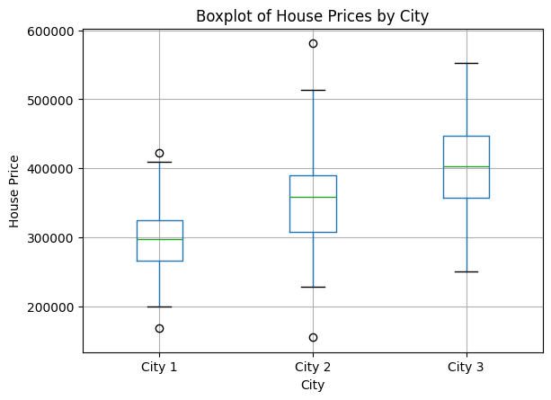
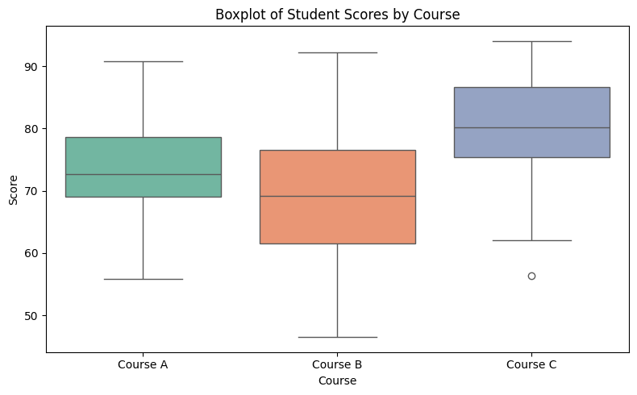

# Advanced Statistical Methods for AB and Hypothesis Testing Methods of Experimentations
This project will showcase advanced statistical methods for A/B testing and hypothesis testing, applying various techniques to experimentations, statistical and data analysis. This project covers `Normality tests`, `Variance tests`, `T-tests`, `Non-parametric`, `Parametric`, `Chi-Square tests` to help make data-driven decisions in experiments. 

| **Test/Method**                        | **Data Type**                          | **Assumptions**                         | **When to Use**                                | **Key Focus**                                  | **Advantages**                                       | **Disadvantages**                                   | **Use Case Example**                                   |
|----------------------------------------|----------------------------------------|-----------------------------------------|------------------------------------------------|-------------------------------------------------|-----------------------------------------------------|-----------------------------------------------------|--------------------------------------------------------|
| **Parametric Tests**                   | Continuous, Normal Distribution        | Normality, Homogeneity of Variance      | When data is normally distributed and continuous | Estimating population parameters (e.g., means)   | More powerful with normal data, precise estimates   | Sensitive to outliers, assumes normality            | Comparing average test scores of students in two different schools (assumes normal distribution) |
| **Non-Parametric Tests**               | Ordinal, Categorical, Non-Normal      | No assumptions on distribution          | When data is non-normal, ordinal, or small sample | Comparing ranks or medians                       | Flexible, no distributional assumptions             | Less powerful than parametric tests in normal data   | Analyzing customer satisfaction ratings (Likert scale data) |
| **Chi-Square Tests**                   | Categorical                            | Independence, Large sample sizes        | When testing relationships between categorical variables | Testing independence or goodness of fit          | Easy to use with categorical data, robust for large samples | Can’t be used with small sample sizes or continuous data | Analyzing whether there is a relationship between gender and voting preference (categorical variables) |

----
# Parametric Tests

----

## Shapiro-Wilk Test (Normality Test)

In many statistical tests (`t-tests`, `ANOVA`, `linear regression`) we assume that the data comes from a normal distribution. If this assumption is violated, the results of these tests might not be valid.

The `Shapiro-Wilk` test helps us to verify if the data meets this assumption, so we can decide wheter to proceed with parametric tests (`t-test` or `ANOVA`) or non-parametric (`Mann-Whitney U test`, `Kruskal-Wallis test`) but most of the case we don't need normarlity in non-parametric tests.

```markdown
When not to use the Shapiro-Wilk:

- If the dataset is large like more then 5000 values in Shapiro-Wilk test become too sensitive. minor deviations from normality lead to rejecting the null hypothesis even if the deviation is not practically significant. 

- The Shapiro-Wilk test is only suitable for continuous numerical data. If the data is categorical (gender, country, product type), the normality test is not applicable.

- If the data is highly skewed or has many outliers, it may violate the assumptions of the Shapiro-Wilk test, and the results might not be meaningful.
```

### Dataset
Using `Iris Plants Database` in this test. The dataset contains a set of `150 records` under `5 attributes` - `Petal Length`, `Petal Width`, `Sepal Length`, `Sepal width` and Class(Species).


### Shapiro-Wilk Normality Test Results
`1. Sepal Length: p-value = 0.0102 (not normally distributed, reject null hypothesis).`

`2. Sepal Width: p-value = 0.0752 (normally distributed, fail to reject null hypothesis).`

`3. Petal Length: p-value = 7.545419569615864e-10 (not normally distributed, reject null hypothesis).`

`4. Petal Width: p-value = 1.8647596517271003e-08 (not normally, reject null hypothesis).`

- **Sepal Width is normally distributed, so parametric tests can be used.**
- **Sepal Length, Petal Length, and Petal Width are not normally distributed. Here we have to use non-parametric tests or applying data transformation for these columns.**

----

## Levene's Test for Equal Variance (Homogeneity of Variance)

Levene's test is used to check the assumption of equal variances (`also known as homogeneity of variances`) across different groups or samples. This assumption is important for many statistical tests, such as `ANOVA` and `t-tests`, which require that the variability within each group being compared is similar. When variances are unequal (heteroscedasticity), it can lead to incorrect conclusions in statistical tests.

- The primary purpose of Levene’s test is to ensure that the assumption of equal variances holds before applying statistical tests that rely on this assumption (like One-Way ANOVA and t-test) and comparing more than two groups if the groups have similar variance

- Levene’s test is particularly useful when comparing more than two groups, and you want to verify if the groups have similar variances.

### State the Hypotheses
- **Null Hypothesis (H₀):** The variances of the groups are equal (homogeneity of variances).

- **Alternative Hypothesis (H₁):** The variances of the groups are not equal (heterogeneity of variances).
### Dataset Description
Using `Housing Price Data` for this test. This dataset has 3 Group of City. `City 1`, `City 2`, `City 3` with `Price` Columns.



### Shapiro-Wilk Normality Test Results

**Normality Check:**

- **City 1:** The p-value is `0.9480`, which is greater than `0.05`, indicating that the data is normally distributed.

- **City 2:** The p-value is `0.1150`, which is greater than `0.05`, indicating that the data is normally distributed.

- **City 3:** The p-value is `0.6759`, which is greater than `0.05`, indicating that the data is normally distributed.


### Levene's Test for Equality of Variance

**The p-value is 0.0006, which is less than 0.05. This indicates that the variances of house prices across the three cities are significantly different.**

---

## Independent T-test or Two Sample T-test

Independent T-test also called two-sample T-test. It is a statistical method used to compare the means of two indenpendent groups to see statistically significant difference between them.

**Why and When we should use it ?**
- We use it to test hypotheses about group differences and it help us to understand any observed difference is real or due to random chance.
- There is two independent groups.
- Comparing the means of two numeric/continuous variable.
- Data should be normally distributed.
- Variances are assumed to be equal or testable.

### Dataset Description

Python code to generate a perfect dataset for performing an `Independent T-test`. We'll create two independent groups (`Group A` and `Group B`) with normally distributed data, ensuring that they have different means, which will give us a noticeable difference when performing the T-test.

        Score      Group
    0  54.967142     A
    1  48.617357     B
    2  56.476885     A
    3  65.230299     B
    4  47.658466     A

### Normality Test (Shapiro-Wilk Test)
**Normality Check:**

**Group A:** The p-value is `0.8290`, which is greater than `0.05`, indicating that the data is normally distributed.

**Group B:** The p-value is `0.2498`, which is greater than `0.05`, indicating that the data is normally distributed.


### Levene's Test for Equality of Variance


- The p-value is `0.5148` for Levene’s Test is greater than `0.05`, which means we fail to reject the null hypothesis (H₀).

- The variances of `Group A` and `Group B` are not significantly different, and we can assume that both groups have equal variances. This is an important assumption for performing the Independent T-test.

### Independent T-test Result

- **The p-value is 0`.0000` extremely small (much less than `0.05`), which means we reject the null hypothesis (`H₀`).**

- **There is a statistically significant difference between Group A and Group B. Since the p-value is extremely small, this result strongly indicates that the difference between the two groups is not due to random chance.**

---
## Paired Sample T-Test (Before vs After Campaign)

A Paired Sample T-test (also known as the Dependent Sample T-test) is a statistical test used to compare the means of two related groups. The test is used to determine whether there is a statistically significant difference between the two related groups.

**Why and When we should use it ?**

- Paired Sample T-test when we want to assess the effect of a treatment or intervention on a group of subject by comparing therir measurements before and after the treatment or intervention.

- The same participants are measured in two conditions or at two points in time

- The observations are not independent but are paired based on some criteria

- **Before and After Studies:** When measuring the same group of individuals at two different times

- **Matched Pairs:** When each participant is matched with another participant who has similar characteristics, and you want to compare their responses in different conditions.

- **Repeated Measures:** When having repeated measurements from the same individuals under different conditions.

### Dataset Description
#### Data Summary
**Total Participants:** 30

**Columns:**

- **Participant:** Unique identifier for each participant (1 through 5).

- **Before Weight (kg):** The weight of each participant before the diet program.

- **After Weight (kg):** The weight of each participant after the diet program.

- **Weight Loss (kg):** The amount of weight lost by each participant.

- **Weight Loss (%):** The percentage of weight lost by each participant.

- **Difference :** Before Weight and After Weight difference 

### Shapiro-Wilk Test for Normality of Differences

**Shapiro-Wilk Test:** Statistic = `0.984`, p-value = `0.91296`

`The differences between before and after weights appear to be normally distributed. We fail to reject the null hypothesis of normality.`

**Since the p-value is greater than 0.05, we fail to reject the null hypothesis and conclude that the differences between the before and after weights appear to be normally distributed. This means the normality assumption for performing a Paired Sample T-Test is met.**


### Paired T-test Result


**Paired Sample T-Test:** T-statistic = `14.974`, p-value = `0.00000`

`Reject the null hypothesis. There is a significant difference between before and after weights, indicating the diet program had an effect.`

**The p-value is less than 0.05, so we reject the null hypothesis and conclude that there is a significant difference between the before and after weights. This suggests that the diet program had a significant effect on the participants' weight loss.**

----

## ANOVA (Analysis of Variance)

ANOVA (`Analysis of Variance`) is a statistical method used to analyze differences between group means and determine whether any of the group means are statistically significantly different from each other. It is essentially used to test if there is a significant variation between multiple groups based on one or more factors.

ANOVA is commonly used when comparing three or more groups or conditions. It is an extension of the t-test, which is used when comparing only two groups.

**Why Use ANOVA?**

- **Compare Means of 2 Groups:** Test if group means differ.

- **Check Variability:** Determine if differences are due to the factor or random noise.

- **Avoid Multiple Tests:** Handles multiple comparisons in one test.

**When to Use ANOVA?**

- **2 Groups:** Comparing three or more groups.

- **Compare Means:** Based on one or more factors.

- **Continuous Data:** Assumes normal distribution.

- **Independent Groups:** Different subjects in each group.

- **Equal Variances:** Assumes similar variances across groups.

**Types of ANOVA**

- **One-Way:** Tests one factor.

- **Two-Way:** Tests two factors.

- **Repeated Measures:** For repeated measurements on the same subjects.

### Dataset Description

#### Data Summary

**Size:** 90 rows

**Columns:**

- **score:** Continuous variable representing exam scores.

- **method:** Categorical variable representing the teaching method used (`Method A`, `Method B`, `Method C`).

- **gender:** Categorical variable representing the gender of the students (`Male`, `Female`).

**Groups:**

- **Teaching Methods:** 3 categories (`Method A`, `Method B`, `Method C`).

- **Gender:** 2 categories (`Male`, `Female`).

- **Scores:** Exam scores are generated randomly with different means and standard deviations for each method:

**Method A:** Mean = `75`, Std = `10`

**Method B:** Mean = `80`, Std = `12`

**Method C:** Mean = `85`, Std = `8`

              score	         method	       gender
    0	79.967142	Method A	Male
    1	73.617357	Method A	Male
    2	81.476885	Method A	Male
    3	90.230299	Method A	Male
    4	72.658466	Method A	Male

### Shapiro-Wilk Test (Normality Check)
```markdown
Shapiro-Wilk Test Results:

Method A: W-statistic=0.9751, p-value=0.6868
Method A: The data is normally distributed.

Method B: W-statistic=0.9837, p-value=0.9130
Method B: The data is normally distributed.

Method C: W-statistic=0.9628, p-value=0.3654
Method C: The data is normally distributed.
```


### Levene’s Test (Equality of Variances)
```markdown
Levene's Test: W-statistic=2.3198, p-value=0.1043
Levene's Test: The variances are equal across groups.
```


### Independent T-test (comparing Method A vs. Method B vs. Method C)
```markdown
Independent T-Test (Method A vs Method B): t-statistic=-2.0720, p-value=0.0427
The means of Method A and Method B are significantly different.

Independent T-Test (Method B vs Method C): t-statistic=-2.6206, p-value=0.0112
The means of Method B and Method C are significantly different.

Independent T-Test (Method A vs Method C): t-statistic=-5.4706, p-value=0.0000
The means of Method A and Method C are significantly different.
```
### One-Way ANOVA (comparing all three methods)
```markdown
One-Way ANOVA (Method A, B, C): F-statistic=12.0572, p-value=0.0000
One-Way ANOVA: There is a significant difference between the methods.
```
**The One-Way ANOVA test revealed a significant difference between the means of the three teaching methods (Method A, Method B, and Method C).This suggests that at least one of the teaching methods leads to significantly different student scores compared to the others.**

----

## Correlation Coefficient
 Correlation Coefficient is a statistical measure that expresses the extent to which two variables are linearly related. it shows the strength and direction of the relationship between two variables. The most common correlation coefficient is the Pearson correlation coefficient.

 **Why and When do we use it ?**

 - **Identifying Relationships:** It helps to understand if and how strongly two variables are related.

 - **Prediction:** It is used in predictive analytics, especially for regression models, where understanding relationships between variables can help predict outcomes.

 - **Decision Making:** In business, economics, or science, knowing the strength and direction of relationships between variables can guide decision-making.

 - when to determine if there is a linear relationship between two continuous variables.
 
 - When to measure the strength and direction of the relationship.
 - When the data is approximately normally distributed (for Pearson correlation).

 **Example Use:**
- **Economics:** Studying the relationship between income and education level.

- **Health:** Investigating the correlation between age and blood pressure.

- **Sales:** Analyzing the relationship between advertising spending and sales performance.

### Dataset Description

	            X	            Y
    0	54.967142	47.890288
    1	48.617357	46.514130
    2	56.476885	54.763313
    3	65.230299	61.218912
    4	47.658466	46.852038


### Shapiro-Wilk Test
```markdown
Shapiro-Wilk Test for X: Statistic = 0.9899, p-value = 0.6552
Shapiro-Wilk Test for Y: Statistic = 0.9906, p-value = 0.7143
X is normally distributed (fail to reject the null hypothesis).
Y is normally distributed (fail to reject the null hypothesis).
```


### Correlation Coefficient

           X         Y
    X  1.000000  0.872404
    Y  0.872404  1.000000
    Correlation Coefficient between X and Y: 0.8724042787137856
```markdown
Pearson Correlation: r=0.8724, p-value=0.0000
```

**Since p < 0.05, we reject the null hypothesis at the 5% level of significance. Therefore, we may conclude that the correlation coefficient between X and Y is statistically significant, indicating a strong positive linear relationship between the two variables.**

----

# Non-Parametric Tests

----

## Mann-Whitney U Test

The Mann-Whitney U test is a non-parametric test used to determine whether there is a difference between two independent groups on a continuous or ordinal variable. It is often used as an alternative to the independent t-test when the data is not normally distributed or when the assumption of homogeneity of variance is violated.

**Why to use it ?**

- **Non-parametric nature:** Unlike the t-test, it does not assume that the data follows a normal distribution, making it ideal for non-normally distributed data.

- **Ordinal or continuous data:** It can be used on ordinal data or when the data cannot be assumed to be normally distributed.

- **Comparing two independent groups:** It is particularly useful when comparing two groups that are independent of each other.

**When to use it ?**

- When we want to compare two independent groups but cannot assume that the data follows a normal distribution.

- When the data is ordinal (e.g., rankings) or continuous but non-normal.

- When sample sizes are small or unequal between the two groups.

- When the assumption of equal variances in the groups (required for the independent t-test) is not met.

### Dataset Description
          Class A Scores	Class B Scores	 Class A Study Hours	Class B Study Hours	Class A  Participation	Class B Participation
    0	79.967142	   72.779521	      4.281239	              6.174740	                9.582064	       9.051084
    1	73.617357	   102.227338	      4.721512	              7.743561	                6.181225	       9.262186
    2	81.476885	   79.838033	      3.340498	              4.736304	                10.805589	       7.003946
    3	90.230299	   67.307469	      3.205690	              5.410208	                5.196298	       9.010958
    4	72.658466	   89.870539	      6.218789	              5.294205	                9.173714	       9.144759

This dataset includes `test scores`, `study hours`, and `participation` scores for two groups of students (`Class A` and `Class B`), with 30 observations each.


### Mann-Whitney U Test

**Interpretation:**

- U Statistic: `310.0`
- P-value: `0.0392` (rounded)

**Since the p-value < 0.05, we reject the null hypothesis, indicating that there is a statistically significant difference in test scores between Class A and Class B.**

----

## Wilcoxon Signed-Rank Test

The Wilcoxon Signed-Rank Test is a `non-parametric` statistical test used to determine whether there is a significant difference between the paired observations. It is the `non-parametric` equivalent of the paired sample `t-test` and is used for comparing two related samples or measurements taken from the same group.

**Why we use it ?**
- The Wilcoxon Signed-Rank Test is used when the data are paired and do not meet the assumptions required for the paired `t-test` (e.g., `normality`).

- It is useful for assessing whether the median of the differences between the pairs is zero, which means there is no difference between the two conditions being compared.

- This test is particularly appropriate for small sample sizes and data with outliers or skewed distributions.

**When we use it ?**
- When comparing two `related` or `paired` samples.

- When the data are `ordinal`, `interval`, or `ratio` but do not meet the assumptions of `normality`.

- It is commonly used in before-and-after experiments or `matched-pair` studies.

### Dataset Description

            Student	     Before Training	After Training
    0	Student 1	   46	           48.106517
    1	Student 2	   59	           70.048483
    2	Student 3	   68	           79.646000
    3	Student 4	   54	           54.213166
    4	Student 5	   50	           50.643332


- **Number of Students:** `30`

- **Before Training Scores:** Randomly generated integer scores between `40` and `70`, representing test scores before training.

- **After Training Scores:** Scores derived by adding a slight improvement (random integers between `3` and `12`) to the original scores, with added random noise (normally distributed) to simulate variability.

#### Before and After Training Scores


#### individual students (before and after)


#### Difference between Before and After Training scores


### Wilcoxon Signed-Rank Test

```markdown
Test Statistic: 0.0
P-value: 1.862645149230957e-09
Reject the null hypothesis: There is a significant difference in scores before and after training.
```

**Interpretation:**

Since the p-value is much smaller than the significance level (`α = 0.05`), we reject the null hypothesis. There is a significant difference in the test scores before and after the training, indicating that the training had an impact on the students' performance.

----

## Kruskal-Wallis Test
The Kruskal-Wallis test is a `non-parametric` statistical test used to determine if there are significant differences between two or more independent groups. It is an extension of the `Mann-Whitney U test` to more than two groups and is used when the assumptions of `one-way ANOVA` (such as `normality`) are not met.

**Why to use it ?**
- The Kruskal-Wallis test is used when the data does not meet the assumptions of `normality` and `homogeneity of variances` required by `ANOVA`.

- It compares the ranks of the values across `multiple groups` rather than the means

- it useful for `ordinal data` or `continuous data` that isn't `normally distributed`.

**When to use it ?**

- When we have more than `two independent groups`.

- When the `dependent variable` is `ordinal` or `continuous` but not `normally distributed`.

- When we cannot assume `homogeneity of variances`.

### Dataset
    	Course	         Score
    0	Course A	79.967142
    1	Course A	73.617357
    2	Course A	81.476885
    3	Course A	90.230299
    4	Course A	72.658466

#### Data Summary
**Number of Entries:** `90` (`30` students in each of `3` courses)

**Features:**

**Course:** Categorical variable with three levels: `Course A`, `Course B`, `Course C`.

**Score:** Continuous variable representing `student scores` with `normally distributed` values for each course.

#### Visualization
##### Comparing Score Distributions

#### Distributions + KDE

#### Overlayed Distributions


### Kruskal-Wallis Test

```markdown
Kruskal-Wallis H-statistic: 18.023150183150165
P-value: 0.0001219895598887542
Reject the null hypothesis: There is a significant difference between the groups.
```

**Interpetation :**

- **Kruskal-Wallis H-statistic:** `18.02`
- **P-value:** `0.00012`

Since the p-value (`0.00012`) is less than the commonly used significance level of `0.05`, we reject the null hypothesis.

----

# Chi-Square Tests

----

## Chi-Square Test of Independence

The Chi-Square Test of Independence is a statistical test used to determine if there is a significant relationship between two categorical variables. It tests whether the distribution of one variable is independent of the distribution of the other variable.

**Why we use it ?**

- We use this test to check if two categorical variables are `independent` or `associated`.

**When we use it ?**

- The Chi-Square Test of Independence is used when you have `two categorical variables` and you want to see if there is a relationship between them.

- The `variables` should be `independent` and come from `random samples`.

- The `categories` within the `variables` should be `mutually exclusive`.

### Data Description
           Gender	Preference
    0	Male	    C
    1	Female	    B
    2	Male	    C
    3	Male	    C
    4	Male	    A

#### Data Summary
**Gender:**

**Unique values:** `2 (Male, Female)`

**Most frequent value:** `Male` (`1017 occurrences`)

**Preference:**

**Unique values:** `3 (A, B, C)`

**Most frequent value:** `A` (`698 occurrences`)

#### Data Visualization


### Chi-Square Test
```markdown
Chi-Square Statistic: 0.5701812407485305
p-value: 0.7519461095939004
Degrees of Freedom: 2
Expected Frequencies: 
[[339.972 332.1   311.928]
[351.028 342.9   322.072]]
Fail to reject the null hypothesis: No significant relationship between the variables.
```

**Since the p-value is much greater than `0.05`, we fail to reject the null hypothesis. This suggests that there is no significant relationship between the gender and preference variables in this dataset. In other words, gender does not appear to influence preference significantly.**

----

## Chi-Square Goodness of Fit

The Chi-Square Goodness of Fit test is a statistical test used to determine if a sample data matches an expected distribution. It compares the observed frequency of events in each category to the expected frequency under the null hypothesis.

**Why we use it ?**

- We use the `Chi-Square Goodness of Fit` test to assess how well the observed data fits a specific `theoretical distribution`.

- This helps us understand whether there is a significant difference between the expected and observed frequencies.

**When we use it ?**

- The data is categorical (`nominal or ordinal`).

- When we have a set of expected `proportions` or `frequencies`.

- When we want to test if the `observed data` follows a `particular distribution` or if there are `significant deviations`.

### Dataset

            Drink	Observed       Expected
    0	Coffee	   111	      279.032258
    1	Tea	   171	      186.021505
    2	Juice	   157	      186.021505
    3	Water	   225	      186.021505
    4	Soda	   243	      186.021505

#### Data Summary
**Total rows:** `10` (representing `10` types of drinks)

**Total columns:** `3` (representing the drink type, observed frequencies, and expected frequencies)

**Drink column:** Contains the drink types.

**Observed column:** Contains randomly generated observed values (based on simulated survey data).

**Expected column:** Contains expected frequencies calculated using predefined proportions.

#### Data Visualization
##### (Observed vs Expected)

##### (Observed Preferences Distribution)

##### (Expected Preferences Distribution)

##### (Distribution of Observed vs Expected)


### Chi-Square Goodness of Fit
```markdown
Chi-Square Statistic: 257.25851981833193
P-Value: 2.923832815953034e-50
Reject the null hypothesis: Significant difference between observed and expected frequencies.
```
-  **Since the p-value is much smaller than the significance level (alpha = 0.05), we reject the null hypothesis.**

-  **This means that there is a significant difference between the observed and expected frequencies. The observed data does not fit the expected distribution, indicating that the preferences for the drinks are not in line with the expected proportions.**

----


